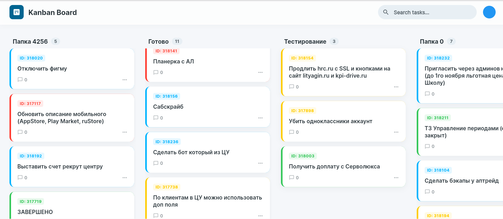

# KPI-DRIVE Kanban

**Flutter SDK:** 3.8.1

---

## Описание

Kanban-приложение на Flutter для управления задачами.

---

## Скриншот



---

## Функционал

---

## Зависимости

* `provider` — управление состоянием
* `dio` — HTTP-запросы (POST, Form-Data)
* `google_fonts` — использование шрифта Inter
* `flutter_dotenv` — работа с переменными окружения

---

## Установка

```bash id="s8d2k1"
flutter pub get
```

Создайте файл `.env` в корне проекта:

```env id="x9f3lm"
BASE_URL=https://api.dev.kpi-drive.ru/_api/indicators
API_TOKEN=YOUR_API_TOKEN_HERE
```

---

## Запуск

```bash id="k2n7pq"
flutter run -d chrome \
  --web-browser-flag=--disable-web-security \
  --web-browser-flag=--user-data-dir=/tmp/flutter_chrome_dev
```

---

## Рекомендации

* Добавьте `.env` в `.gitignore`
* Не храните токены в открытом виде в репозитории
* Используйте переменные окружения для защиты конфиденциальных данных
